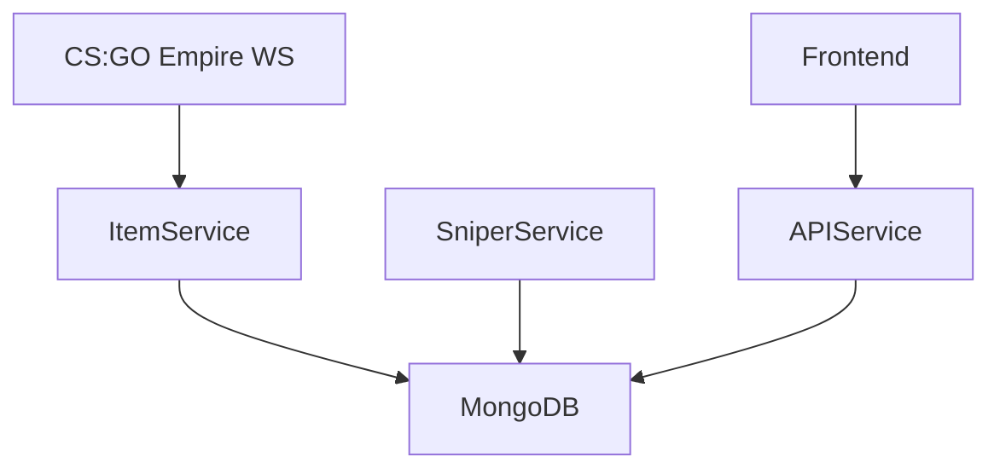

# Auction Wizard

Auction Wizard is a CS:GO skin sniping prototype. Users could set custom filters (price, float, market name) for CS:GO Empire listings, receive matches, and (in future plans) fully automate sniping and purchasing.

---

## Features

- Real-time WebSocket data from CS:GO Empire
- User-defined sniper filters:
  - Item name
  - Max price
  - Float range
- Live match detection and frontend display
- Planned (not implemented): auto-bidding, auto-withdraw, multi-market price comparison

---

## Architecture

- **itemService.js** — connects to Empire WebSocket and stores listings
- **SniperService** — infinite loop processing user snipers against live listings
- **apiService.js** — REST API for user config, matches, snipers
- **MongoDB** — stores users, snipers, items


---
## Tech Stack

- Frontend: React, Next.js, Tailwind CSS
- Backend: Node.js, Express, Mongoose
- Database: MongoDB
- WebSocket Feed: CS:GO Empire

---

## Development Setup

```bash
git clone <repo-url>
cd backend && npm install
cd ../frontend && npm install
```

Set environment variables for MongoDB and API URLs.

Run servers:

```bash
# Backend
cd backend && npm run dev

# Frontend
cd frontend && npm run dev
```

Frontend runs at `http://localhost:3000`

---

## Screenshots

### Sniper Filter Setup


### Match Found


### Project Overview


### Homepage


### Login


---

## Project Status

**Archived:** Project paused to focus on smaller, more manageable builds before returning to full automation.

---

_Michael Bazett — 2025_
```

---
