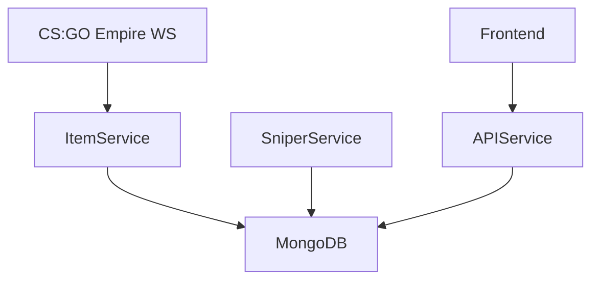

# Auction Wizard

Auction Wizard is a CS:GO skin sniping prototype. Users could set custom filters (price, float, market name) for CS:GO Empire listings, receive matches, and (in future plans) fully automate sniping and purchasing.

## Features

- Real-time WebSocket data from CS:GO Empire
- User-defined sniper filters:
  - Item name
  - Max price
  - Float range
- Live match detection and frontend display
- Planned (not implemented): auto-bidding, auto-withdraw, multi-market price comparison

## Architecture

- **itemService.js** — connects to Empire WebSocket and stores listings
- **SniperService** — infinite loop processing user snipers against live listings
- **apiService.js** — REST API for user config, matches, snipers
- **MongoDB** — stores users, snipers, items



## Tech Stack

- Frontend: React, Next.js
- Backend: Node.js, Express, Mongoose
- Database: MongoDB
- WebSocket Feed: CS:GO Empire


## Development Setup

```bash
git clone <repo-url>
cd /auction-wizard-backend && npm install
cd auction-wizard-fronted && npm install
```

Set environment variables for MongoDB and API URLs.
The MongoDB is current set to run locally, so MongoDB must be installed on the system.
Run servers:

```bash
# Backend
cd auction-wizard-backend && npm start

# Frontend
cd auction-wizard/fronted && npm start
```

Frontend runs at `http://localhost:3000`

---

## Screenshots

### Sniper Filter Setup


### Match Found


### Project Overview


### Homepage


### Login


---

## Project Status

**Archived:** Project paused to focus on smaller, more manageable builds before returning to full automation.

---

_Michael Bazett — 2025_
```

---
